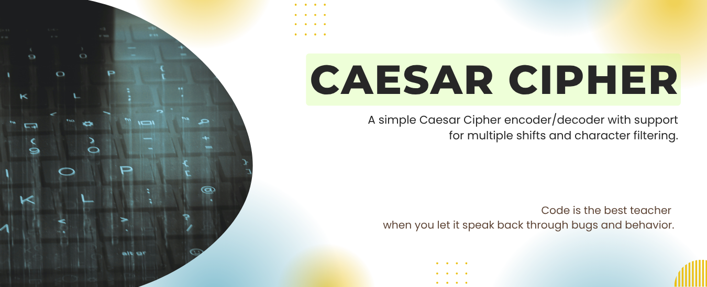
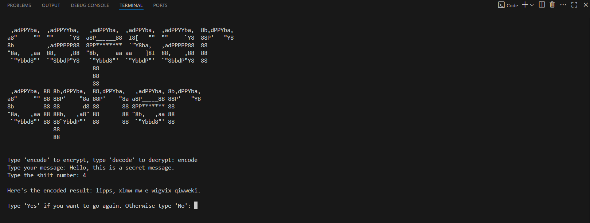

<p> </p>

## Features

- Encode and decode messages
- Shift characters with wraparound logic
- Ignores punctuation and special symbols

<br/>

## 🛠️ Prerequisites

- Python 3.8+
- No external libraries required

<br/>

## 💻 How to Run

**1. Clone the repository:**

```bash
git clone https://github.com/mudasirfayaz/hands-on-python-lab.git
cd hands-on-python-lab/01-Beginner/caesar-cipher
```

**2. Run the script:**

```bash
python caeser-cipher.py
```

> [!WARNING]
> Make sure you have Python 3 installed and accessible from your terminal or command prompt.

<br/>

## 🧪 Example Output



<br/>

## 🤝 Contributing

We welcome contributions from everyone! If you'd like to improve this project, add features, or report bugs

<br/>

> [!IMPORTANT]
> Before you begin, please read our [**Contributing Guidelines**](/CONTRIBUTING.md).

<br/>

## 🧑‍💻 Author

**[Mudasir Fayaz](https://github.com/mudasirfayaz/)** - Student | Tech Enthusiast | Lifelong Learner<br/>
_Building fun and useful Python tools_

<br/>

# 📜 License

This project is licensed under the MIT License — see the [LICENSE](/LICENSE) file for details.

<br/>


