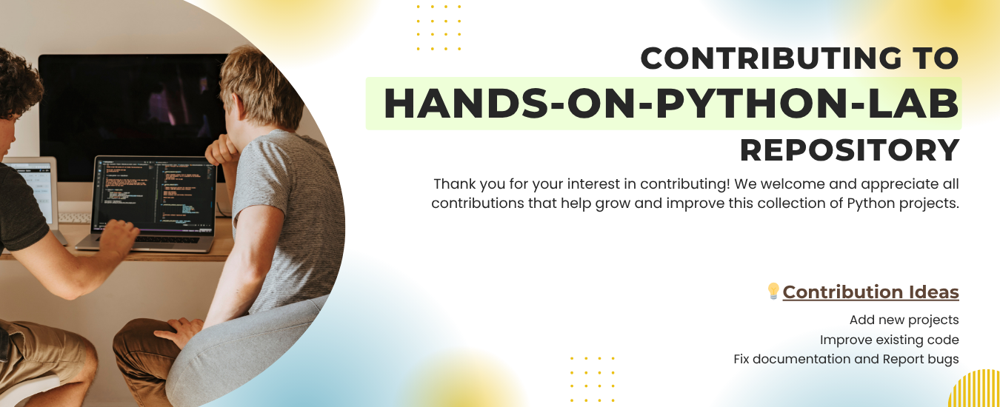
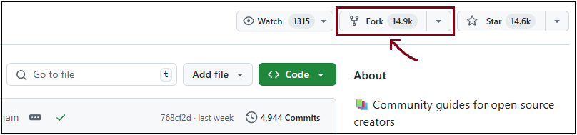
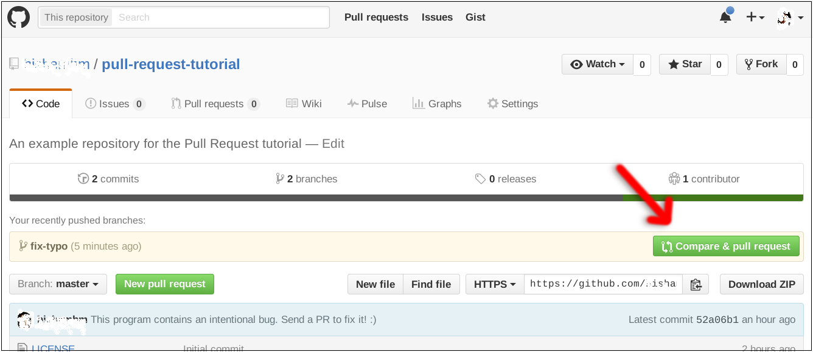

<p> </p>


<br/>

## Repository Structure

Please place your project in the appropriate difficulty folder:

- `01-Beginner/`
- `02-Intermediate/`
- `03-Advanced/`

Each project must:

- Be placed in a **dedicated folder**.
- Include a `README.md` using the [README Template](./README_TEMPLATE.md) (provided in this repo).
- Follow Python [PEP-8](https://peps.python.org/pep-0008/) style guidelines.
- Be functional and self-contained.

<br/>

## Contribution Guidelines

**1. Fork the Repository**



<br/>

- Click "Fork" button at top-right of this repo
- (Creates your copy at github.com/your-github-username/hands-on-python-lab)

<br/>

**2. Clone Your Fork**

```bash
git clone https://github.com/your-github-username/hands-on-python-lab.git
cd hands-on-python-lab
```

<br/>

> [!WARNING]
> Replace \<your-github-username\>!

<br/>

**3. Create a Feature Branch**

```bash
git checkout -b <branch-name>
```

<br/>

**4. Make and Test Your Changes**

- Add new projects or improve existing ones
- Test your code locally

> Make sure to add or update `README.md`

<br/>

**5. Commit and Push**

Add the changes with `git add`, `git commit`:

```bash
git add .
git commit -m "<your message>"
```

Push the code _to your repository_.

```bash
git push origin <branch-name>
```

<br/>

**6. Open a Pull Request**



<br/>

- Go to your fork on GitHub
- Click "Compare & Pull Request"
- Describe your changes clearly

<br/>

## Pull Request Requirements

- ✅ Include a `README.md` for new projects
- ✅ Update `README.md` for new features.
- ✅ Make sure your code runs without errors.
- ✅ Avoid adding third-party dependencies unless necessary.
- ✅ Follow directory and naming conventions.

<br/>


<p> </p>

This project is licensed under the MIT License — see the [LICENSE](./LICENSE) file for details.

_(Need help? Open an [issue](https://github.com/mudasirfayaz/hands-on-python-lab/issues).)_
