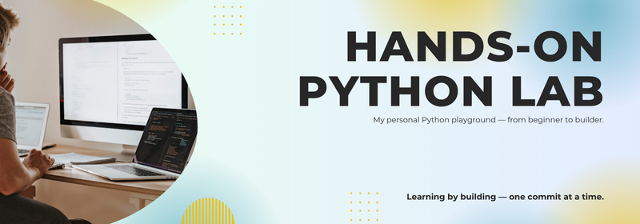

 

 

## Hands-On Python Lab

A curated set of practical Python mini-projects created to reinforce essential programming concepts through hands-on experience. Projects range from beginner to intermediate level, each focusing on real-world applications and problem-solving.

 

## Repository Overview 🚀

- **Self-contained projects:** Each project is in its own folder for easy navigation.
- **Clear documentation:** Every project includes a `README.md` with usage and concept details.
- **Concept-focused:** Projects cover Python basics, data structures, OOP, and input validation.
- **Real-world examples:** Includes games and utility scripts for practical learning.
- **Continuously updated:** New projects are added as learning progresses.

 

## Project Index 📁

| Project Name                                    | Description                                                                       |
| ----------------------------------------------- | --------------------------------------------------------------------------------- |
| [`number-guessing-game`](/number-guessing-game) | A fun, interactive number guessing game built using Python                        |
| [`password-generator`](/password-generator)     | Generates secure random passwords based on user preferences.                      |
| [`calculator`](/calculator)                     | A clean, interactive, and beginner-friendly command-line calculator               |
| [`rock-paper-scissors`](/rock-paper-scissors)   | A simple command-line implementation of the classic Rock-Paper-Scissors game      |
| [`hangman`](/hangman)                           | A simple command-line implementation of the classic Hangman game in Python        |
| [`caesar-cipher`](/caesar-cipher)               | Encode and decode messages using Caesar Cipher logic                              |
| [`coffee-machine`](/coffee-machine)             | A simple Python-based CLI that simulates the behavior of a coffee vending machine |
| [`coffee-machine-oop`](/coffee-machine-oop)     | Coffee machine refactored using OOP principles                                    |
| [`quiz-game`](/quiz-game)                       | A simple terminal-based quiz app built using Python and OOP and Open Trivia data  |
| [`hirst-spot-painting`](/hirst-spot-painting)   | A creative dot-art generator built using Python's `turtle` graphics module        |
| [`turtle-race`](/turtle-race)                   | Fun turtle race where user bets on the winning color                              |
| [`snake-game`](/snake-game)                     | Enjoy a classic **Snake Game** crafted with Python's `turtle` graphics            |
| [`pong-game`](/pong-game)                       | A modern, refactored implementation of the classic **Pong** game                  |
| [`us-states-game`](/us-states-game)             | An interactive Python-based quiz game where players guess all 50 U.S. states      |
| [`nato-alphabet`](/nato-alphabet)               | Display NATO phonetic alphabet representation of a word                           |
| ...more coming soon!                            | 🚧                                                                                |

> 📌 More projects will be added over time as I explore advanced topics (APIs, GUIs, file I/O, etc.)

 

## Purpose 🎯

- Deepen Python proficiency through engaging, real-world mini-projects that reinforce core programming concepts.
- Build a portfolio of completed projects, demonstrating hands-on experience and practical application of Python skills.
- Showcase problem-solving abilities, creativity, and progress in learning by tackling diverse challenges from games to utility scripts.
- Prepare for advanced topics and professional opportunities by mastering foundational techniques and best practices.
- Track personal growth and learning milestones with each completed project.
- Facilitate collaborative learning and knowledge sharing within the Python community.

 

## Concepts Covered 🧠

- ✅ **Python Fundamentals:** Variables, loops, conditionals, and functions
- ✅ **Data Structures:** Lists, tuples, dictionaries, and sets
- ✅ **Object-Oriented Programming:** Classes, encapsulation, abstraction, and inheritance
- ✅ **Command-Line Interaction:** User input handling and validation
- ✅ **Modular Design:** Writing scalable and maintainable code

 

## Contributing 🤝

Contributions are welcome! To participate:

1. Fork this repository.
2. Clone your fork locally.
3. Create a feature branch (`git checkout -b feature/your-feature-name`).
4. Make your changes.
5. Commit and push to your fork.
6. Open a pull request.

 

> [!IMPORTANT]
> Please review our [**Contributing Guidelines**](./CONTRIBUTING.md) before starting.

 

## License 📜

This project is licensed under the MIT License — see the [LICENSE](./LICENSE) file for details.

 

 

_(Need help? Open an [issue](https://github.com/mudasirfayaz/hands-on-python-lab/issues).)_
