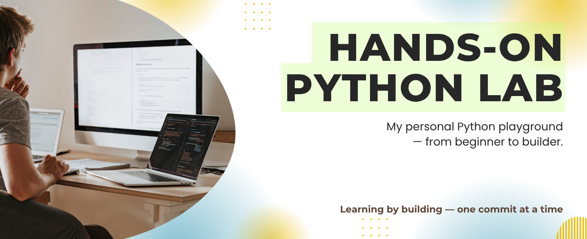

 

 

## Hands-On Python Lab

A curated set of practical Python mini-projects created to reinforce essential programming concepts through hands-on experience. Projects range from beginner to intermediate level, each focusing on real-world applications and problem-solving.

 

## Repository Overview 🚀

- **Self-contained projects:** Each project is in its own folder for easy navigation.
- **Clear documentation:** Every project includes a `README.md` with usage and concept details.
- **Concept-focused:** Projects cover Python basics, data structures, OOP, and input validation.
- **Real-world examples:** Includes games and utility scripts for practical learning.
- **Continuously updated:** New projects are added as learning progresses.

 

## Project Index 📁

| Project Name                                     | Description                                          |
| ------------------------------------------------ | ---------------------------------------------------- |
| [`caesar-cipher`](./caesar-cipher)               | Encode and decode messages using Caesar Cipher logic |
| [`calculator`](./calculator)                     | Simple calculator supporting basic arithmetic        |
| [`hangman`](./hangman)                           | Classic Hangman word guessing game                   |
| [`number-guessing-game`](./number-guessing-game) | Guess the randomly generated number                  |
| [`password-generator`](./password-generator)     | Generate secure random passwords                     |
| [`rock-paper-scissors`](./rock-paper-scissors)   | Play Rock-Paper-Scissors against the computer        |
| [`coffee-machine`](./coffee-machine)             | Simulate a coffee vending machine                    |
| [`coffee-machine-oop`](./coffee-machine-oop)     | Coffee machine refactored using OOP principles       |
| [`hirst-spot-painting`](/hirst-spot-painting)    | Recreates Hirst-style dot paintings using Turtle     |
| [`turtle-race`](./turtle-race)                   | Fun turtle race where user bets on the winning color |
| [`snake-game`](./snake-game)                     | Classic Snake game built with OOP and Turtle         |
| [`quiz-game`](./quiz-game)                       | A terminal-based quiz using OOP and Open Trivia data |
| ...more coming soon!                             | 🚧                                                   |

> 📌 More projects will be added over time as I explore advanced topics (APIs, GUIs, file I/O, etc.)

 

## Purpose 🎯

- Deepen Python proficiency through engaging, real-world mini-projects that reinforce core programming concepts.
- Build a portfolio of completed projects, demonstrating hands-on experience and practical application of Python skills.
- Showcase problem-solving abilities, creativity, and progress in learning by tackling diverse challenges from games to utility scripts.
- Prepare for advanced topics and professional opportunities by mastering foundational techniques and best practices.
- Track personal growth and learning milestones with each completed project.
- Facilitate collaborative learning and knowledge sharing within the Python community.

 

## Concepts Covered 🧠

- ✅ **Python Fundamentals:** Variables, loops, conditionals, and functions
- ✅ **Data Structures:** Lists, tuples, dictionaries, and sets
- ✅ **Object-Oriented Programming:** Classes, encapsulation, abstraction, and inheritance
- ✅ **Command-Line Interaction:** User input handling and validation
- ✅ **Modular Design:** Writing scalable and maintainable code

 

## Contributing 🤝

Contributions are welcome! To participate:

1. Fork this repository.
2. Clone your fork locally.
3. Create a feature branch (`git checkout -b feature/your-feature-name`).
4. Make your changes.
5. Commit and push to your fork.
6. Open a pull request.

 

> [!IMPORTANT]
> Please review our [**Contributing Guidelines**](./CONTRIBUTING.md) before starting.

 

## License 📜

This project is licensed under the MIT License — see the [LICENSE](./LICENSE) file for details.

 

 

_(Need help? Open an [issue](https://github.com/mudasirfayaz/hands-on-python-lab/issues).)_
