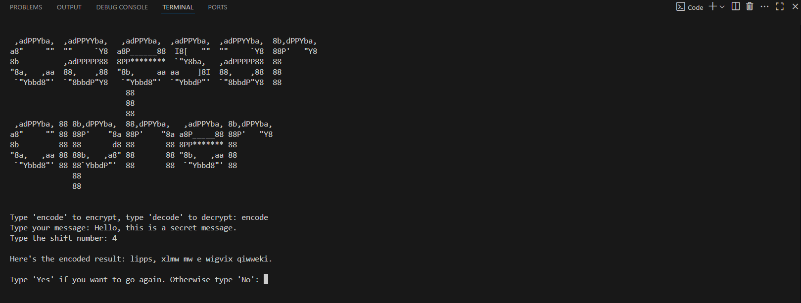

# Caesar Cipher

> A simple Caesar Cipher encoder/decoder with support for multiple shifts and character filtering.

<br/>

## Features

- Encode and decode messages
- Shift characters with wraparound logic
- Ignores punctuation and special symbols

<br/>

## 🛠️ Prerequisites

- Python 3.8+
- Built-in modules:
  - `string` — provides a collection of useful constants and classes for working with strings.

<br/>

## 💻 How to Run

**1. Clone the repository:**

```bash
git clone https://github.com/mudasirfayaz/hands-on-python-lab.git
cd hands-on-python-lab/caesar-cipher
```

**2. Run the script:**

```bash
python caeser-cipher.py
```

<br/>

> [!WARNING]
> Make sure you have Python 3 installed and accessible from your terminal or command prompt.

<br/>

## 🧪 Example Output



<br/>

## 🤝 Contributing

Contributions are welcome and encouraged — whether you're fixing a typo, improving documentation, or adding a new mini-project to the lab!

<br/>

> [!IMPORTANT]
> Before you begin, please read our [**Contributing Guidelines**](/CONTRIBUTING.md).

<br/>

## 🧑‍💻 Author

**[Mudasir Fayaz](https://github.com/mudasirfayaz/)** - Student | Tech Enthusiast | Lifelong Learner<br/>
_Building fun and useful Python tools_

<br/>

# 📜 License

This project is licensed under the MIT License — see the [LICENSE](/LICENSE) file for details.

<br/>


