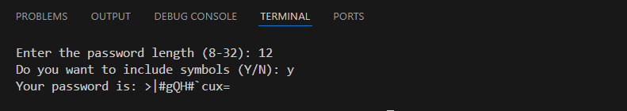

# Password Generator

> A simple Python script to generate secure random passwords based on user preferences.

<br/>

## Features

- Generates passwords with customizable length (8-32 characters)

- Option to include or exclude special symbols

- Uses cryptographically secure pseudo-random number generation

- Simple command-line interface

<br/>

## 🛠️ Prerequisites

- Python 3.8+
- Built-in modules:
  - `random` — generating pseudo-random numbers
  - `string` — provides a collection of useful constants and classes for working with strings.

<br/>

## 💻 How to Run

1. **Clone the repository:**

   ```bash
   git clone https://github.com/mudasirfayaz/python-learning-projects.git
   cd python-learning-projects/01-Beginner/password-generator
   ```

2. **Run the script:**

   ```bash
   python password.py
   ```

> [!WARNING]
> Make sure you have Python 3 installed and accessible from your terminal or command prompt.

<br/>

## 🧪 Example Output



<br/>

## 🤝 Contributing

Pull requests are welcome. For major changes, please open an issue first to discuss what you’d like to change or improve.

<br/>

## 🧑‍💻 Author

**[Mudasir Fayaz](https://github.com/mudasirfayaz/)** - Student | Tech Enthusiast | Lifelong Learner<br/>
_Building fun and useful Python tools_

<br/>

# 📜 License

This project is licensed under the MIT License — see the [LICENSE](./LICENSE) file for details.
