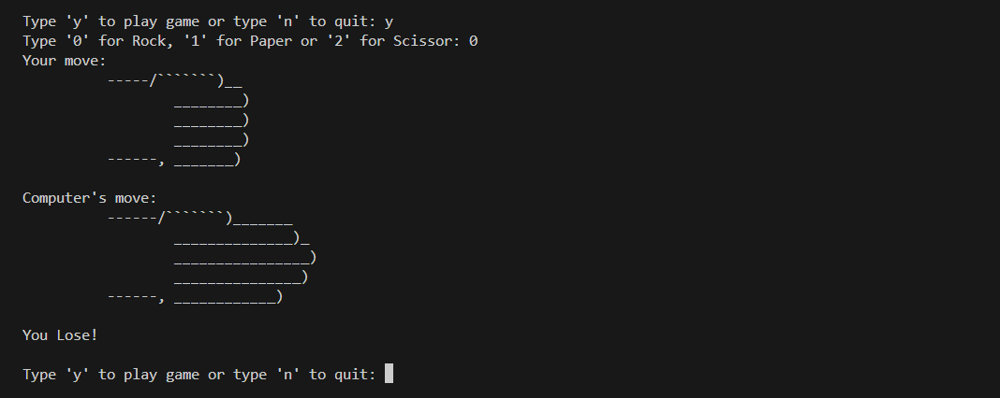

# Rock-Paper-Scissors Game

> A simple command-line implementation of the classic Rock-Paper-Scissors game with ASCII art visuals.

<br/>

## Features

- Play against the computer in the classic Rock-Paper-Scissors game
- Visual representation of choices using ASCII art
- Simple and intuitive interface
- Option to play multiple rounds

<br/>

## 🛠️ Prerequisites

- Python 3.8+
- Built-in modules:
  - `random` — for number generation

<br/>

## 💻 How to Play

**1. Clone the repository:**

```bash
git clone https://github.com/mudasirfayaz/hands-on-python-lab.git
cd hands-on-python-lab/rock-paper-scissors
```

**2. Run the script:**

```bash
python game.py
```

<br/>

> [!WARNING]
> Make sure you have Python 3 installed and accessible from your terminal or command prompt.

3. **Follow the prompts:**

- Type 'y' to start a game
- Enter:
  - '0' for Rock ✊
  - '1' for Paper ✋
  - '2' for Scissors ✌️
- The computer will randomly select its move
- The winner is determined based on standard [Rock-Paper-Scissors rules](#game-rules)
- Choose to play again or quit

<br/>

## 🧪 Example Gameplay



<br/>

## Game Rules

- Rock crushes Scissors
- Scissors cut Paper
- Paper covers Rock
- Same choice results in a draw

<br/>

## 🤝 Contributing

Contributions are welcome and encouraged — whether you're fixing a typo, improving documentation, or adding a new mini-project to the lab!

<br/>

> [!IMPORTANT]
> Before you begin, please read our [**Contributing Guidelines**](/CONTRIBUTING.md).

<br/>

## 🧑‍💻 Author

**[Mudasir Fayaz](https://github.com/mudasirfayaz/)** - Student | Tech Enthusiast | Lifelong Learner<br/>
_Building fun and useful Python tools_

<br/>

## 📜 License

This project is licensed under the MIT License — see the [LICENSE](./LICENSE) file for details.

<br/>


